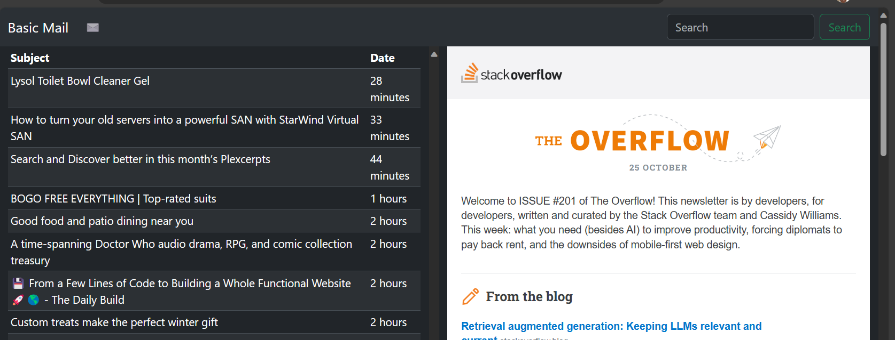

# Basic Mail

It' a web email client with simple styling, rule engine, and tools to manage mail.  It uses IMAP protocal.


## Screenshots




## Environment Variables

To run this project, you will need to add the following environment variables to your .env file

`SECERT_KEY`


## Installation

Install my-project with npm

```bash
  npm install my-project
  cd my-project
```
    
## API Reference

#### Get emails

```http
  GET /api/mail/{folder}
```

| Parameter | Type     | Description                                  |
| :-------- | :------- | :------------------------------------------- |
| `folder`  | `string` | **Optional**. IMAP folder. defaults to INBOX |
| `q`       | `string` | **Optional**. Search                         |

#### Single Email

```http
  GET /api/mail/{folder}/{uid}
```

| Parameter | Type     | Description                               |
| :-------- | :------- | :---------------------------------------- |
| `uid`     | `string` | **Required**. Uid of email to fetch       |
| `meta`    | `bool`   | **Optional**. Get only meta data of email |


```http
  DELETE /api/mail/{folder}/{uid}
```

```http
  PUT /api/mail/{folder}/{uid}/{flag}
```
| Parameter | Type     | Description                         |
| :-------- | :------- | :---------------------------------- |
| `uid`     | `string` | **Required**. Uid of email to fetch |
| `flag`    | `string` | **Required**. Set flag on email     |

#### Logout

```http
  GET /logout
```

Removes session from cookies

#### Authenticate

Returns a json web token aka JWT and stores it in a new session cookie with information to manage user session.

```http
  POST /authenticate
```

JSON payload example

```json
{
  "email":"foo@acme.org",
  "password":"bar",
  "server": "imap.acme.org",
  "port": 993
}
```

Using the response JWT, a Authoriation header can be used with the value. This is typically used for automating a workflow.


## Roadmap

- Local HTTPS support

- Rule engine API / UX


## License

[MIT](https://choosealicense.com/licenses/mit/)


https://getbootstrap.com/docs/5.3/utilities/display/#hiding-elements